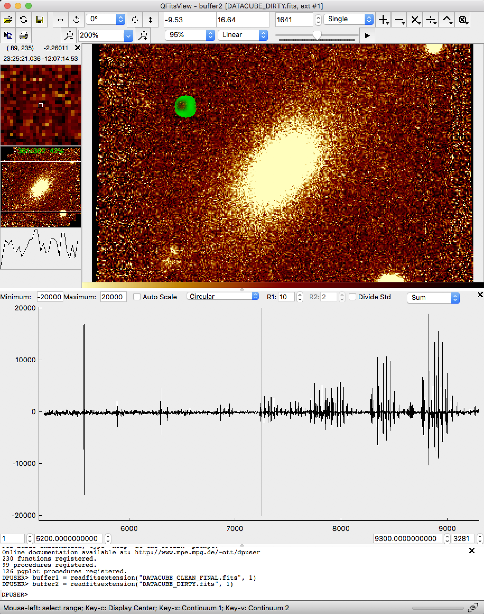
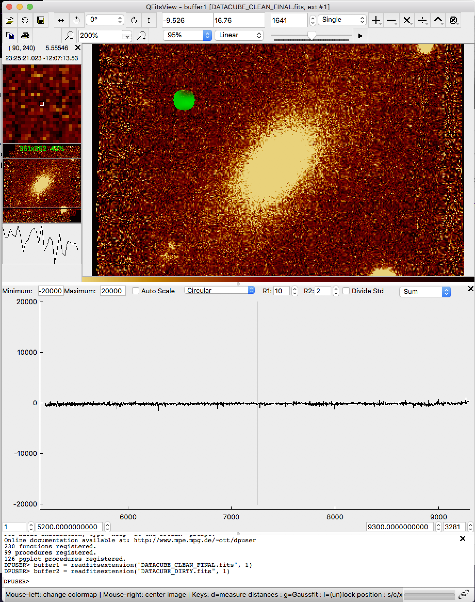

# Aoide

*"[Aoide](https://en.wikipedia.org/wiki/Aoide),
one of the nine daughters of Zeus and Mnemosyne..."*

#### Dr. Grant R. Tremblay | Astrophysicist | Harvard-Smithsonian Center for Astrophysics


Aoide is a suite of Python tools for [MUSE](https://www.eso.org/sci/facilities/develop/instruments/muse.html),
an optical Integral Field Unit (IFU) spectrograph on ESO's Very Large Telescope.


### Step 0: Optional Convenience Aliases

In my `.bashrc` on Linux (or `.bash_profile` on macOS), I have set the following BASH aliases:
```
alias aoideid='/home/grant/Repositories/aoide/bin/AoideID.py'
alias aoidereduce='/home/grant/Repositories/aoide/bin/AoideReduce.py'
alias aoidepost='/home/grant/Repositories/aoide/bin/AoidePost.py'
```

You may want to do the same! In the below examples, I assume that Aoide scripts
such as `AoideReduce.py` are in your PATH. This will not automatically be the case, of course.
You could fix that by putting
```
export PATH=$PATH:/path/to/aoide/bin
```
in your `.bashrc`. 

### Step 1: Check for Raw Data Completeness

`cd` to the `raw_data_directory` in which you have placed all `*.fits.fz` raw MUSE data downloaded from the [ESO Archive](http://archive.eso.org).

Run
```
AoideReduce.py
```
with no arguments. It will print simple information about the directory contents. Make sure it looks okay (i.e., you have the correct data for your requested observation). You can save this list by, e.g., typing
```
AoideReduce.py > contents.txt
tail -f contents.txt
```


### Step 2: Use Aoide to run the MUSE Pipeline




